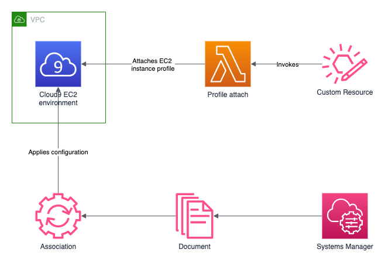

# custom-cloud9-ssm
<!--BEGIN STABILITY BANNER-->

---


> All classes are under active development and subject to non-backward compatible changes or removal in any
> future version. These are not subject to the [Semantic Versioning](https://semver.org/) model.
> This means that while you may use them, you may need to update your source code when upgrading to a newer version of this package.

---
<!--END STABILITY BANNER-->

| **Language**     | **Package**        |
|:-------------|-----------------|
| Python|[`cdk_use_cases.custom_cloud9_ssm`](https://pypi.org/project/cdk-use-cases.custom-cloud9-ssm/)|
| Typescript|[`@cdk-use-cases/custom-cloud9-ssm`](https://www.npmjs.com/package/@cdk-use-cases/custom-cloud9-ssm)|

This pattern implements a Cloud9 EC2 environment, applying an initial configuration to the EC2 instance using an SSM Document. It includes helper methods to add steps and parameters to the SSM Document and to resize the EBS volume of the EC2 instance to a given size.

Here is a minimal deployable pattern definition in Typescript:

``` typescript
new CustomCloud9Ssm(stack, 'CustomCloud9Ssm');
```

You can view [other usage examples](#other-usage-examples).

## Initializer

``` typescript
new CustomCloud9Ssm(scope: Construct, id: string, props: CustomCloud9SsmProps);
```

_Parameters_
    
* scope [`Construct`](https://docs.aws.amazon.com/cdk/api/latest/docs/@aws-cdk_core.Construct.html)
* id `string`
* props [`CustomCloud9SsmProps`](#pattern-construct-props)

## Pattern Construct Props

| **Name**     | **Type**        | **Description** |
|:-------------|:----------------|-----------------|
| ssmDocumentProps? | [ssm.CfnDocumentProps](https://docs.aws.amazon.com/cdk/api/latest/docs/@aws-cdk_aws-ssm.CfnDocumentProps.html) | Optional configuration for the SSM Document. |
| cloud9Ec2Props? | [cloud9.CfnEnvironmentEC2Props](https://docs.aws.amazon.com/cdk/api/latest/docs/@aws-cdk_aws-cloud9.CfnEnvironmentEC2Props.html) | Optional configuration for the Cloud9 EC2 environment. |

## Pattern Properties

| **Name**     | **Type**        | **Description** |
|:-------------|:----------------|-----------------|
| ec2Role | [iam.Role](https://docs.aws.amazon.com/cdk/api/latest/docs/@aws-cdk_aws-iam.Role.html) | The IAM Role that is attached to the EC2 instance launched with the Cloud9 environment to grant it permissions to execute the statements in the SSM Document. |

## Pattern Methods

``` typescript
public addDocumentSteps(steps: string): void
```

_Description_

Adds one or more steps to the content of the SSM Document.

_Parameters_

* steps `string`: YAML formatted string containing one or more steps to be added to the `mainSteps` section of the SSM Document.

``` typescript
public addDocumentParameters(parameters: string): void
```

_Description_

Adds one or more parameters to the content of the SSM Document.

_Parameters_

* parameters `string`: YAML formatted string containing one or more parameters to be added to the `parameters` section of the SSM Document.

``` typescript
public resizeEBSTo(size: number): void
```

_Description_

Adds a step to the SSM Document content that resizes the EBS volume of the EC2 instance. Attaches the required policies to `ec2Role`.

_Parameters_

* size `number`: size in GiB to resize the EBS volume to.

``` typescript
public deployCDKProject(url: string, stackName: string = ''): void
```

_Description_

Adds a step to the SSM Document content that deploys a CDK project from its compressed version.

_Parameters_

* url `string`: from where to download the file using the wget command 
* stackName `string`: name of the stack to deploy

## Default settings

Out of the box implementation of the Construct without any override will set the following defaults:

### Cloud9 EC2 environment
* Creates a Cloud9 EC2 environment with:
    * T3.large instance type.
    * Image id amazonlinux-2023-x86_64.

### SSM Document
* Creates an SSM Document with:
    * A step that installs jq.
    * A step that resizes the EBS volume of the EC2 instance to 50 GiB.

## Architecture


## Other usage examples

_Using default configuration and adding steps_

``` typescript
import {CustomCloud9Ssm} from '@cdk-use-cases/custom-cloud9-ssm';

// Define a step that installs boto3
const boto3Step = `
- name: InstallBoto3
  action: aws:runShellScript
  inputs:
    runCommand:
    - "#!/bin/bash"
    - sudo pip install boto3
`

// Create the custom environment
let customCloud9 = new CustomCloud9Ssm(this, 'CustomCloud9Ssm')

// Add your step to the default document configuration
customCloud9.addDocumentSteps(boto3Step)
```

_Providing props for the SSM Document and resizing the EBS volume_

``` typescript
import {CustomCloud9Ssm, CustomCloud9SsmProps} from '@cdk-use-cases/custom-cloud9-ssm';
const yaml = require('yaml')

// Define the content of the document
const content = `
schemaVersion: '2.2'
description: Bootstrap Cloud9 EC2 instance
mainSteps:
- name: InstallBoto3
  action: aws:runShellScript
  inputs:
    runCommand:
    - "#!/bin/bash"
    - sudo pip install boto3
`

// Specify the configuration for the SSM Document
const cloud9Props: CustomCloud9SsmProps = {
    ssmDocumentProps: {
        documentType: 'Command',
        content: yaml.parse(content),
        name: 'MyDocument'
    }
}

// Create the custom environment
let customCloud9 = new CustomCloud9Ssm(this, 'CustomCloud9Ssm', cloud9Props)

// Add a step to resize the EBS volume to 50GB
customCloud9.resizeEBSTo(50)
```

***
&copy; Copyright 2021 Amazon.com, Inc. or its affiliates. All Rights Reserved.
