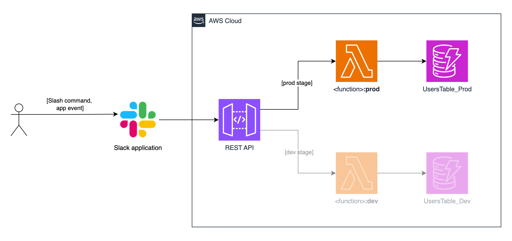

# Amazon Q Business Application with Slack integration

Author: Borja Pérez Guasch <bpguasch@amazon.es>

## Introduction

This repository contains a CDK Python sample that provides a quick-start to deploy an Amazon Q Business application and integrate it with Slack. The following components are deployed as part of the custom Construct:

- An **Amazon Api Gateway REST API** that intercepts [Slack application events](https://api.slack.com/apis/events-api) and [Slack slash commands](https://api.slack.com/interactivity/slash-commands)
- An **AWS DynamoDB table** to store Slack usernames, user ids and channel ids
- Two **AWS Secrets Manager secrets** to safely store your [Slack bot token](https://api.slack.com/concepts/token-types#bot) and your [Slack signing secret](https://api.slack.com/authentication/verifying-requests-from-slack)
- A set of **AWS Lambda functions** to reply to Slack application events and Slack slash commands
- An **AWS Lambda layer** with helper methods used across functions
- An **Amazon Q Business application** without user interface
- An **Amazon S3 bucket** to store the data sources of the Amazon Q Business Application

## In this page

- [Project architecture](#project-architecture)
- [Creating and configuring your Slack application](#creating-and-configuring-your-slack-application)
- [Out of the box features](#out-of-the-box-features)
- [Understanding the code](#understanding-the-code)
- [Deploying this sample](#deploying-this-sample)
- [Adding data sources to the Q Business Application](#adding-data-sources-to-the-q-business-application)
- [Testing the application](#testing-the-application)
- [Cleaning up](#cleaning-up)

## Project architecture

An AWS API Gateway REST API acts as the communication point between the Slack application and the rest of AWS resources. It has two publicly accessible endpoints:

- `handle-slack-event`: invoked by the Slack application whenever the user triggers an application event, such as opening the home tab.
- `handle-slash-command`: invoked by the Slack application whenever the user triggers the slash command to use the `ask` or `help` operations.

Each of those endpoints will synchronously invoke the corresponding AWS Lambda function to handle the request. Those functions:
1. Verify the authenticity of the request by using your [signing secret](https://api.slack.com/authentication/verifying-requests-from-slack)
2. Handle the request honoring Slack's 3 seconds timeout
3. Send an [acknowledgement response](https://api.slack.com/interactivity/handling#acknowledgment_response)

In the case of the `handleSlackEvent` function, after verifying the authenticity of the request, it will:
1. If the event is `url_verification` [(see here)]((https://api.slack.com/events/url_verification)), handle it by replying with the received challenge.
2. If the event is `app_home_opened` and it's the first time that the user triggers it, onboard them to the application by configuring their application home tab and sending them a welcome message.

In the case of the `handleSlashCommand` function, after verifying the authenticity of the request, it will:
1. Validate the format of the received command.
2. If the operation to be performed is `ask`, asynchronously invoke the `ask` function passing the user text as an argument.
3. If the operation to be performed is `help`, asynchronously invoke the `help` function.

In regard to operation execution:

- The `help` function will post a message to the user's channel with the help contents that you define. See [out of the box features](#out-of-the-box-features).
- The `ask` function will post a *processing* message to the user's channel and asynchronously invoke the `chat_sync` function.
- The `chat_sync` function will take user's text and perform an API call to the Q Business application. Finally. it will update the previous *processing* text with the response of the model.


To facilitate the testing process, two completely isolated environments –dev and prod– are deployed. This is achieved by:

1. Deploying two aliases for each AWS Lambda function. The **prod** alias points to the latest published function version, whereas the **dev** alias points to the *$LATEST* version.
2. Creating two stages in the REST API. Each stage points to the corresponding AWS Lambda function alias.
3. Creating two AWS DynamoDB tables for storing user data. Each AWS Lambda function alias uses its corresponding table.

When the user triggers an application event (such as opening the app home tab) or invokes a slash command normally, the production environment is used:



On the other hand, if the user invokes a slash command with the `--dev` option (they must have permission to do so, see [understanding the code](#understanding-the-code)), the development environment is used:


## Creating and configuring your Slack application

1. After signing in to your workspace of choice, navigate to [the application creation page](https://api.slack.com/apps), click on *Create New App* and chose **From scratch**:


2. Provide an application name and pick the workspace where you want your app deployed.
3. In the **Basic Information** tab, you can already find your **Signing Secret**, which you will need when deploying the infrastructure. From this tab you can also customise your app's Display Information:


4. Under **Features**, in the **App Home** tab, toggle **Always Show My Bot as Online**, **Home Tab** and **Messages Tab**.
5. Under **Features**, in the **OAuth & Permissions** tab, scroll down until you find **Bot Token Scopes** and add the following scopes: `chat:write`, `incoming-webhook` and `users.profile:read`.
6. Now that you have added some scopes, you can request to install the application in the workspace. This will generate a **Bot token**, which you also need to deploy the infrastructure. Under **Settings**, go to **Install App**, click on **Request to Install** and follow all the steps.
7. After installing the application in the workspace, go back to the **OAuth & Permissions** tab and you'll find your Bot token under **OAuth Tokens**.

As of this point you will need your REST API endpoints, so you will need to deploy the infrastructure before continuing. Refer to [deploying this sample](#deploying-this-sample) and continue with step 8 when you are done.

8. Now it's time to enable interactivity in the application. Under **Features**, in the **Slash Commands** tab, create one command that will invoke your application. Fill the Request URL field with the `prod` stage REST API endpoint that contains `handle-slash-command`.


> **Important**: you will need to replace the value of the `SLASH_COMMAND` constant in the AWS Lambda layer with the command that you just defined. See [understanding the code](#custom-aws-lambda-layer).

9. Next, under **Features**, in the **Event Subscriptions** tab, toggle **Enable Events** and fill the Request URL field with the `prod` stage REST API endpoint that contains `handle-slack-event`. If you select the correct one, it should verify shortly.
10. In the same page, under **Subscribe to bot events**, add `app_home_opened`.
11. Since you have now enabled Slash commands, the Bot token scopes have changed, and you need to reinstall the application in the workspace.

> **Congratulations**, your Slack integration is now complete! If you open the home tab of your app in Slack, you should receive a welcome message. You can now [test the application](#testing-the-application) or see [understanding the code](#understanding-the-code).

## Out of the box features

If you deploy the sample as-is and configure the integration with Slack, the application will:

- The first time a user opens the home tab of your application in Slack:
  1. Send them a welcome message with the contents you define in `q_business_slack_app_construct/assets/lambda_/func_handle_slack_event/blocks/onboarding.json`
  2. Configure their app home tab with the contents you define in `q_business_slack_app_construct/assets/lambda_/func_handle_slack_event/blocks/home.json`
  3. Register them in the DynamoDB table
- In regard to slash commands:
  1. Parse them in form of `/slash-command [operation] [options]`. For instance `/my-bot help` or `my-bot ask "your question to the model here" --option_1 --option_2=something`. 
  2. Recognise the `ask` and `help` operations and execute them accordingly.
  3. Validate the format of the command as well as operation and options, automatically replying with an error message if the user typed something mistakenly.
  4. The `help` operation will reply with the contents that you define in `q_business_slack_app_construct/assets/lambda_/func_help/response_block.json`
  5. The `ask` operation will take the user's question, pass it to the model and return its response. You can control the formatting of the messages by defining the contents of `q_business_slack_app_construct/assets/lambda_/func_ask/response_block.json` and `q_business_slack_app_construct/assets/lambda_/func_chat_sync/blocks/`

> No data sources are added to the Q Business application as part of the deployment process. To add data sources, see [adding data sources](#adding-data-sources-to-the-q-business-application).

> To format the messages that your application sends to users, see [Slack Block Kit](https://api.slack.com/block-kit).

## Understanding the code

### CDK Project

- All the application logic is encapsulated in the construct `QBusinessSlackApp` defined in the `q_business_slack_app_construct` package. If you want to use this construct in other CDK projects, simply copy and paste the package. 
- The `main_stack` module of the `stacks` package implements the stack that is deployed when running `cdk deploy`. It instantiates the custom construct mentioned above:

```python
class MainStack(Stack):
    def __init__(self, scope: Construct, construct_id: str, **kwargs) -> None:
        super().__init__(scope, construct_id, **kwargs)

        QBusinessSlackApp(self, "QBusinessSlackApp")
```

If you want the application to behave as explained in the previous sections, **you don't need to make any changes in the infrastructure definition**. The code of the Lambda functions is defined inside the `assets/lambda_` path.

Feel free to add any files to the folder `assets/q_app_bucket_contents`, which will be uploaded as part of the deployment process, and you can later consume as a data source for your Q Business application.

### Custom AWS Lambda Layer

There are a set of utility functions and manager classes used across AWS Lambda functions that are exposed through an AWS Lambda Layer. The contents of this layer are in `assets/lambda_layer/python`. You can see that this layer contains the Slack SDK and the package `app_layer`, which is where the following packages are implemented:

#### Entity managers

- `slack_manager`: contains the class `SlackManager`, which defines a set of methods that encapsulate the interaction with the Slack SDK.
- `users_manager`: defines a set of methods that encapsulate the interaction with the boto3 library to operate with DynamoDB resources.

#### Utils

- `lambda_utils`: encapsulates the logic of determining the AWS Lambda invocation environment –dev or prod–.
- `secrets_manager_utils`: defines a set of methods that encapsulate the interaction with the boto3 library to operate with SecretsManager resources.
- `slack_utils`: encapsulates the logic of verifying requests, parsing commands and validating operations.
- `slack_operations_definition`: defines what operations exist in each environment and which users have permission to execute those.

> Remember to update the value of the `SLASH_COMMAND` constant defined in the `slack_operations_definition` module with the command that you created in step 8 of [creating and configuring your Slack application](#creating-and-configuring-your-slack-application).


## Deploying this sample

### 1. Cloning the repository

After navigating to your path of choice, run this command to clone this repository:

```bash
git clone git@github.com:aws-samples/cdk-use-cases.git
```

### 2. Creating a virtual environment and installing project dependencies

#### 2.1 Creating the virtual environment

```python
cd cdk-use-cases/use_cases/q-business-slack-app
python3 -m venv .venv
```

#### 2.2 Installing project dependencies in the virtual environment

```python
source .venv/bin/activate
python3 -m pip install -r requirements.txt
```

### 3. Bootstrapping your AWS account

Deploying AWS CDK apps into an AWS environment may require that you provision resources the AWS CDK needs to perform the deployment.
These resources include an Amazon S3 bucket for storing files and **IAM roles that grant permissions needed to perform deployments**.
Execute the following command to bootstrap your environment:

```bash
cdk bootstrap
```

You can read more about this process [here](https://docs.aws.amazon.com/cdk/v2/guide/bootstrapping.html).

### 4. Deploying using CDK

When deploying the stack:

1. You must pass the values of your Slack bot token and Slack signing secret as stack parameters, which are then stored as secrets in AWS Secrets Manager
2. You may specify an application name, which is used as a suffix in other resources' names to facilitate identifying them. If you don't specify one, the default `q-business-slack-app` is used. **Only lowercase letters and the `-` symbol are accepted.**

To deploy the stack specifying a value for all the parameters, run the command below, replacing *value* with actual values:

```bash
cdk deploy --parameters SlackToken=<value> --parameters SlackSigningSecret=<value> --parameters AppName=<value>
```

The deployment process will take roughly **5 minutes** to complete.

## Adding data sources to the Q Business Application

You can add data sources through the AWS Console or programmatically. To add sources using the AWS Console:

1. Navigate to the Amazon Q Business service page
2. Under **Applications**, click on the one that was deployed as part of the stack
3. Create and Index and connect your desired data sources, such as the deployed S3 Bucket or a Web Crawler.

For more details, check [the documentation](https://docs.aws.amazon.com/amazonq/latest/qbusiness-ug/data-sources.html).

## Testing the application

After deploying the infrastructure and configuring the integration with Slack, open the home tab of your application in Slack:
1. If it's the first time that you do so, you should receive a welcome message. You can also verify that your user details have been stored in the DynamoDB table.
   - If the first time that you open the home tab you don't receive a message, verify that your [event subscriptions](#creating-and-configuring-your-slack-application) are properly configured.

Open the messages tab of your application in Slack:
1. Type `/<your-slash-command> help`: the application should reply with the contents you've defined in `q_business_slack_app_construct/assets/lambda_/func_help/response_block.json`
   - If you don't receive a message, verify that your [slash command](#creating-and-configuring-your-slack-application) is configured properly and that the response blocks are in accordance to Slack's expected syntax.
2. Type `/<your-slash-command> ask` "*Your question to the model here*": the application should show a *processing* message with the question you've typed, and some seconds later the message should update with the response of the model. 
   - If you don't receive a message, verify that your [slash command](#creating-and-configuring-your-slack-application) is configured properly.
   - Also verify that your data sources have been properly added to the Q Business application, and that there has been at least one successful sync.

The two operations that come out of the box accept the option `--dev` when invoked, for instance `/<your-slash-command> help --dev`. You can use this to influence which AWS Lambda function alias is invoked by the `handleSlashCommand` dispatcher function.

To define which operations are available in each environment and which users can invoke them, see [understanding the code](#understanding-the-code).

See below how the user interface looks like:


## Cleaning up

Option 1) deleting all the resources created by CDK using the AWS Console:

1. Navigate to the **CloudFormation** section in the AWS console.
2. Select the stack named **QBusinessSlackApp** and click on **Delete**.

Option 2) deleting all the resources created by CDK using the CLI:

Navigate to the directory where you initially cloned the project and execute the following command:

```bash
cdk destroy
```
